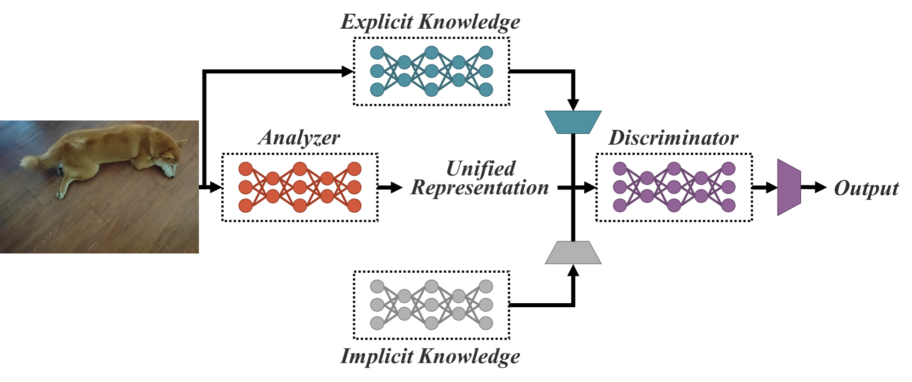
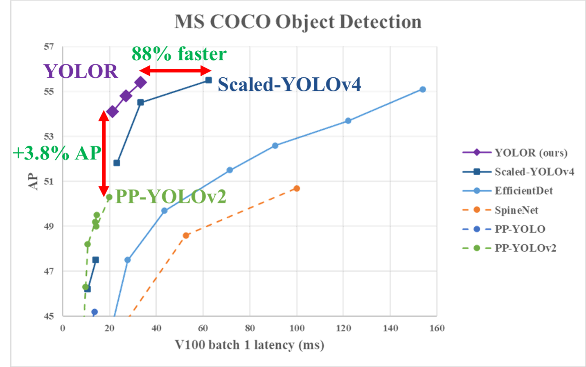
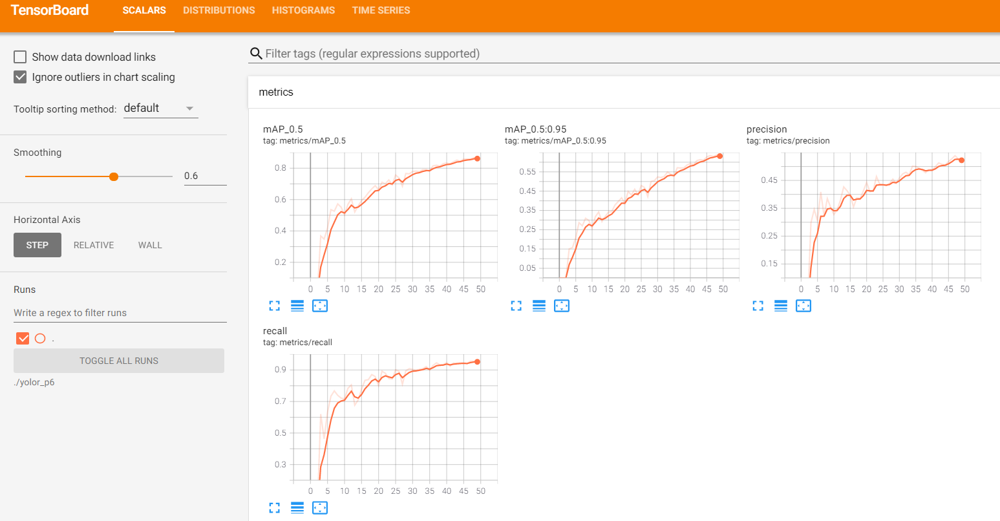
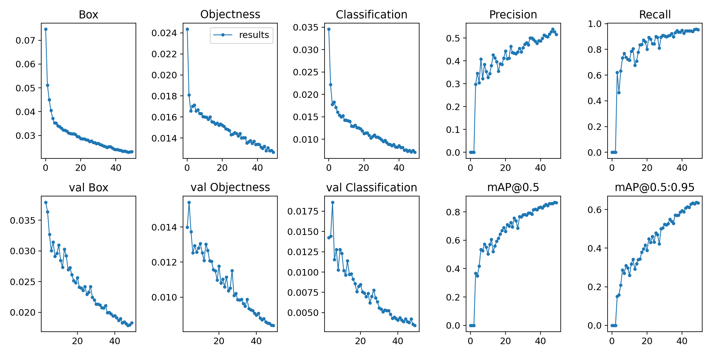
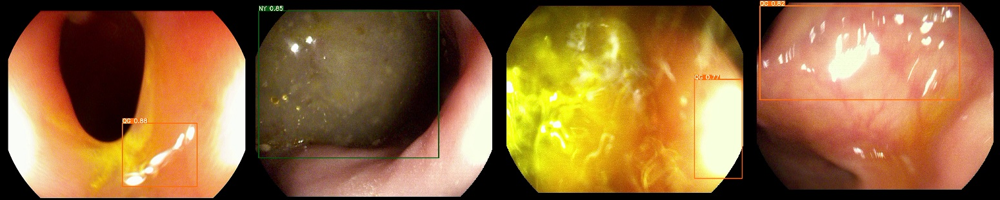

## YOLOR 自定义数据集训练模型



感谢大佬[WongKinYiu](https://github.com/WongKinYiu/yolor)大佬的开源，其关于Pytorch版的YOLO v4和Scaled-YOLOv4也是相当不错！

+ GitHub: https://github.com/WongKinYiu/yolor

+ Paper: https://arxiv.org/abs/2105.04206

  



我们将从下面几个部分详细介绍如何基于自定义的数据集训练自己的YOLOR模型，并基于TensorRT提供C++版本的TensorRT YOLOR的部署方案。

+ 安装YOLOR的的依赖环境
+ 创建自己的YOLOR目标检测的数据集
+ 准备YOLOR的预训练模型
+ YOLOR的模型训练
+ YOLOR模型的推断（基于图像和视频）
+ 基于YOLOR的TensorRT C++ 代码实现

### 1.安装YOLOR的依赖环境

基于Docker创建YOLOR的镜像，这也是作者推荐的方式，这里假设读者已经安装好了Docker和nvidia-docker2,该方式仅在Linux下工作，因为nvidia-docker2仅在Linux下工作，如果你是windows系统建议你通过虚拟机的方式或直接在windows host下安装下述环境

```shell
# 创建docker容器，这里假设你已经安装了docker和nvidia-docker2
docker pull nvcr.io/nvidia/pytorch:20.11-py3
nvidia-docker run --name yolor -it -v your_coco_path/:/coco/ -v your_code_path/:/yolor --shm-size=64g nvcr.io/nvidia/pytorch:20.11-py3
# sudo nvidia-docker run --name yolor -it --shm-size=64g nvcr.io/nvidia/pytorch:20.11-py3

# 在容器内apt install required packages
apt update
apt install -y zip htop screen libgl1-mesa-glx

# 在容器内pip install required packages
pip install seaborn thop
pip install nvidia-pyindex
pip install onnx-graphsurgeon


# install mish-cuda if you want to use mish activation
# https://github.com/thomasbrandon/mish-cuda
# https://github.com/JunnYu/mish-cuda
cd /
git clone https://github.com/JunnYu/mish-cuda
cd mish-cuda
python setup.py build install

# install pytorch_wavelets if you want to use dwt down-sampling module
# https://github.com/fbcotter/pytorch_wavelets
cd /
git clone https://github.com/fbcotter/pytorch_wavelets
cd pytorch_wavelets
pip install .

# go to code folderls
cd /yolor

```


### 2.创建自己的YOLOR目标检测数据集

YOLOR支持YOLOv5类型的标注数据构建，如果你熟悉YOLOv5的训练集的构造过程，该部分可以直接跳过，这里我们提供了构建数据集的代码，将数据集存放在`./datasets`下：

```shell
./datasets/score   # 存放的文件，score是数据集的名称
├─images           # 训练图像，每个文件夹下存放了具体的训练图像
│  ├─train
│  └─val
└─labels           # label，每个文件夹下存放了具体的txt标注文件，格式满足YOLOv5
    ├─train
    └─val
```

我们提供了VOC标注数据格式转换为YOLOv5标注的具体代码，存放在`./datasets`下，关于YOLOv5的标注细节可以参考：<https://github.com/DataXujing/YOLO-v5>


### 3.准备YOLOR的预训练模型

+ 1.修改模型的配置文件

i. 训练数据的配置`./data/score.yaml`

```shell
train: ./datasets/score/images/train/
val: ./datasets/score/images/val/

# number of classes
nc: 3
# class names
names: ['QP', 'NY', 'QG']
```

ii.模型结构的配置

我们以训练YOLOR-P6，需要修改模型的配置文件，其修改方式类似于darkent版的YOLOv3,期主要修改的参数在模型的head部分，详细的参考`./cfg/yolor_p6_score.cfg`,其主要修改部分我已经标注出来，如下：

```shell
# ============ End of Neck ============ #

# 203
[implicit_add]
filters=256

# 204
[implicit_add]
filters=384

# 205
[implicit_add]
filters=512

# 206
[implicit_add]
filters=640

# 207   #<------------(number_class + 5) *3
[implicit_mul]
filters=24      

# 208   #<------------(number_class + 5) *3
[implicit_mul]
filters=24

# 209  #<------------(number_class + 5) *3
[implicit_mul]
filters=24

# 210  #<------------(number_class + 5) *3
[implicit_mul]
filters=24

# ============ Head ============ #

# YOLO-3

[route]
layers = 163

[convolutional]
batch_normalize=1
size=3
stride=1
pad=1
filters=256
activation=silu

[shift_channels]
from=203

# <---------------- filters: (number_class + 5) *3
[convolutional]
size=1
stride=1
pad=1
filters=24
activation=linear

[control_channels]
from=207

# <---------------classess: 3
[yolo]
mask = 0,1,2
anchors = 19,27,  44,40,  38,94,  96,68,  86,152,  180,137,  140,301,  303,264,  238,542,  436,615,  739,380,  925,792
classes=3
num=12
jitter=.3
ignore_thresh = .7
truth_thresh = 1
random=1
scale_x_y = 1.05
iou_thresh=0.213
cls_normalizer=1.0
iou_normalizer=0.07
iou_loss=ciou
nms_kind=greedynms
beta_nms=0.6


# YOLO-4

[route]
layers = 176

[convolutional]
batch_normalize=1
size=3
stride=1
pad=1
filters=384
activation=silu

[shift_channels]
from=204

# <---------------- filters: (number_class + 5) *3
[convolutional]
size=1
stride=1
pad=1
filters=24
activation=linear

[control_channels]
from=208

# <--------------- classes: 3
[yolo]
mask = 3,4,5
anchors = 19,27,  44,40,  38,94,  96,68,  86,152,  180,137,  140,301,  303,264,  238,542,  436,615,  739,380,  925,792
classes=3
num=12
jitter=.3
ignore_thresh = .7
truth_thresh = 1
random=1
scale_x_y = 1.05
iou_thresh=0.213
cls_normalizer=1.0
iou_normalizer=0.07
iou_loss=ciou
nms_kind=greedynms
beta_nms=0.6


# YOLO-5

[route]
layers = 189

[convolutional]
batch_normalize=1
size=3
stride=1
pad=1
filters=512
activation=silu

[shift_channels]
from=205

# <---------------- filters: (number_class + 5) *3
[convolutional]
size=1
stride=1
pad=1
filters=24
activation=linear

[control_channels]
from=209

# <------------------classes: 3
[yolo]
mask = 6,7,8
anchors = 19,27,  44,40,  38,94,  96,68,  86,152,  180,137,  140,301,  303,264,  238,542,  436,615,  739,380,  925,792
classes=3
num=12
jitter=.3
ignore_thresh = .7
truth_thresh = 1
random=1
scale_x_y = 1.05
iou_thresh=0.213
cls_normalizer=1.0
iou_normalizer=0.07
iou_loss=ciou
nms_kind=greedynms
beta_nms=0.6


# YOLO-6

[route]
layers = 202

[convolutional]
batch_normalize=1
size=3
stride=1
pad=1
filters=640
activation=silu

[shift_channels]
from=206

# <---------------- filters: (number_class + 5) *3
[convolutional]
size=1
stride=1
pad=1
filters=24
activation=linear

[control_channels]
from=210

# <-------------classes： 3
[yolo]
mask = 9,10,11
anchors = 19,27,  44,40,  38,94,  96,68,  86,152,  180,137,  140,301,  303,264,  238,542,  436,615,  739,380,  925,792
classes=3
num=12
jitter=.3
ignore_thresh = .7
truth_thresh = 1
random=1
scale_x_y = 1.05
iou_thresh=0.213
cls_normalizer=1.0
iou_normalizer=0.07
iou_loss=ciou
nms_kind=greedynms
beta_nms=0.6

# ============ End of Head ============ #

```

+ 2.预训练模型的下载

To reproduce the results in the paper, please use this branch.

| Model         | Test Size | AP<sup>test</sup> | AP<sub>50</sub><sup>test</sup> | AP<sub>75</sub><sup>test</sup> | AP<sub>S</sub><sup>test</sup> | AP<sub>M</sub><sup>test</sup> | AP<sub>L</sub><sup>test</sup> | batch1 throughput |
| :------------ | :-------: | :---------------: | :----------------------------: | :----------------------------: | :---------------------------: | :---------------------------: | :---------------------------: | :---------------: |
| **YOLOR-P6**  |   1280    |     **52.6%**     |           **70.6%**            |           **57.6%**            |           **34.7%**           |           **56.6%**           |           **64.2%**           |     49 *fps*      |
| **YOLOR-W6**  |   1280    |     **54.1%**     |           **72.0%**            |           **59.2%**            |           **36.3%**           |           **57.9%**           |           **66.1%**           |     47 *fps*      |
| **YOLOR-E6**  |   1280    |     **54.8%**     |           **72.7%**            |           **60.0%**            |           **36.9%**           |           **58.7%**           |           **66.9%**           |     37 *fps*      |
| **YOLOR-D6**  |   1280    |     **55.4%**     |           **73.3%**            |           **60.6%**            |           **38.0%**           |           **59.2%**           |           **67.1%**           |     30 *fps*      |
|               |           |                   |                                |                                |                               |                               |                               |                   |
| **YOLOv4-P5** |    896    |     **51.8%**     |           **70.3%**            |           **56.6%**            |           **33.4%**           |           **55.7%**           |           **63.4%**           |     41 *fps*      |
| **YOLOv4-P6** |   1280    |     **54.5%**     |           **72.6%**            |           **59.8%**            |           **36.6%**           |           **58.2%**           |           **65.5%**           |     30 *fps*      |
| **YOLOv4-P7** |   1536    |     **55.5%**     |           **73.4%**            |           **60.8%**            |           **38.4%**           |           **59.4%**           |           **67.7%**           |     16 *fps*      |
|               |           |                   |                                |                                |                               |                               |                               |                   |

| Model                                 | Test Size | AP<sup>val</sup> | AP<sub>50</sub><sup>val</sup> | AP<sub>75</sub><sup>val</sup> | AP<sub>S</sub><sup>val</sup> | AP<sub>M</sub><sup>val</sup> | AP<sub>L</sub><sup>val</sup> | FLOPs |                           weights                            |
| :------------------------------------ | :-------: | :--------------: | :---------------------------: | :---------------------------: | :--------------------------: | :--------------------------: | :--------------------------: | :---: | :----------------------------------------------------------: |
| **YOLOR-P6**                          |   1280    |    **52.5%**     |           **70.6%**           |           **57.4%**           |          **37.4%**           |          **57.3%**           |          **65.2%**           | 326G  | [yolor-p6.pt](https://drive.google.com/file/d/1WyzcN1-I0n8BoeRhi_xVt8C5msqdx_7k/view?usp=sharing) |
| **YOLOR-W6**                          |   1280    |    **54.0%**     |           **72.1%**           |           **59.1%**           |          **38.1%**           |          **58.8%**           |          **67.0%**           | 454G  | [yolor-w6.pt](https://drive.google.com/file/d/1KnkBzNxATKK8AiDXrW_qF-vRNOsICV0B/view?usp=sharing) |
| **YOLOR-E6**                          |   1280    |    **54.6%**     |           **72.5%**           |           **59.8%**           |          **39.9%**           |          **59.0%**           |          **67.9%**           | 684G  | [yolor-e6.pt](https://drive.google.com/file/d/1jVrq8R1TA60XTUEqqljxAPlt0M_MAGC8/view?usp=sharing) |
| **YOLOR-D6**                          |   1280    |    **55.4%**     |           **73.5%**           |           **60.6%**           |          **40.4%**           |          **60.1%**           |          **68.7%**           | 937G  | [yolor-d6.pt](https://drive.google.com/file/d/1WX33ymg_XJLUJdoSf5oUYGHAtpSG2gj8/view?usp=sharing) |
|                                       |           |                  |                               |                               |                              |                              |                              |       |                                                              |
| **YOLOR-S**                           |    640    |    **40.7%**     |           **59.8%**           |           **44.2%**           |          **24.3%**           |          **45.7%**           |          **53.6%**           |  21G  |                                                              |
| **YOLOR-S**<sub>DWT</sub>             |    640    |    **40.6%**     |           **59.4%**           |           **43.8%**           |          **23.4%**           |          **45.8%**           |          **53.4%**           |  21G  |                                                              |
| **YOLOR-S<sup>2</sup>**<sub>DWT</sub> |    640    |    **39.9%**     |           **58.7%**           |           **43.3%**           |          **21.7%**           |          **44.9%**           |          **53.4%**           |  20G  |                                                              |
| **YOLOR-S<sup>3</sup>**<sub>S2D</sub> |    640    |    **39.3%**     |           **58.2%**           |           **42.4%**           |          **21.3%**           |          **44.6%**           |          **52.6%**           |  18G  |                                                              |
| **YOLOR-S<sup>3</sup>**<sub>DWT</sub> |    640    |    **39.4%**     |           **58.3%**           |           **42.5%**           |          **21.7%**           |          **44.3%**           |          **53.0%**           |  18G  |                                                              |
| **YOLOR-S<sup>4</sup>**<sub>S2D</sub> |    640    |    **36.9%**     |           **55.3%**           |           **39.7%**           |          **18.1%**           |          **41.9%**           |          **50.4%**           |  16G  | [weights](https://drive.google.com/file/d/1rFoRk1ZoKvE8kbxAl2ABBy6m9Zl6_k4Y/view?usp=sharing) |
| **YOLOR-S<sup>4</sup>**<sub>DWT</sub> |    640    |    **37.0%**     |           **55.3%**           |           **39.9%**           |          **18.4%**           |          **41.9%**           |          **51.0%**           |  16G  | [weights](https://drive.google.com/file/d/1IZ1ix1hwUjEMcCMpl67CHQp98XOjcIsv/view?usp=sharing) |
|                                       |           |                  |                               |                               |                              |                              |                              |       |                                                              |

需要注意的是上述表格中的预训练模型下载地址对应了作者paper中的结果，不能加载在本项目的训练中，如果使用本项目需要在训练时加载预训练模型下载如下链接：

```shell
# YOLOR-P6:
https://drive.google.com/uc?export=download&id=1Tdn3yqpZ79X7R1Ql0zNlNScB1Dv9Fp76

# YOLOR-W6
https://drive.google.com/uc?export=download&id=1UflcHlN5ERPdhahMivQYCbWWw7d2wY7U

#YOLOR-CSP
https://drive.google.com/file/d/1ZEqGy4kmZyD-Cj3tEFJcLSZenZBDGiyg/view?usp=sharing

# YOLOR-CSP*
https://drive.google.com/file/d/1OJKgIasELZYxkIjFoiqyn555bcmixUP2/view?usp=sharing

# YOLOR-CSP-X
https://drive.google.com/file/d/1L29rfIPNH1n910qQClGftknWpTBgAv6c/view?usp=sharing

# YOLOR-CSP-X*
https://drive.google.com/file/d/1NbMG3ivuBQ4S8kEhFJ0FIqOQXevGje_w/view?usp=sharing
```


### 4.模型训练

训练的主要参数：

- **img:** 输入图像的size
- **batch:** 训练的batch size
- **epochs:** 训练的周期
- **data:** yaml配置文件路径
- **cfg:** 模型的配置文件
- **weights:** 预训练模型的加载路径
- **name:** result names
- **hyp:** 训练的超参数

```shell
python train.py --batch-size 8 --img 1280 1280 --data './data/score.yaml' --cfg cfg/yolor_p6_score.cfg --weights './pretrain/yolor-p6.pt' --device 0 --name yolor_p6 --hyp './data/hyp.scratch.1280.yaml' --epochs 300
# 为了验证过程的可行性，我们仅训练了50个epoch！！！
```

查看模型的训练过程：

```shell
tensorboard --logdir "./yolor_p6" --host 0.0.0.0
```



训练结果：



### 5.模型推断

为了方便测试和部署，基于`detect.py`我们实现了图像和视频的测试代码，分别存放在`test_img.py`和`test_video.py`,其调用方式为：

```shell
# 图像推断
python test_img.py

# 视频推断
python test_video.py
```

demo:




### 6.TensorRT C++实现

1.模型转ONNX

```shell
  python convert_to_onnx.py --weights ./runs/train/yolor_p6/weights/best_overall.pt --cfg cfg/yolor_p6_score.cfg --output yolor_p6.onnx
```

**TODO**: 因SILU激活函数在Pytorch中目前无法转换到ONNX,在ONNX转换的过程中就出现了问题，我们会在稍后花时间解决该问题。

